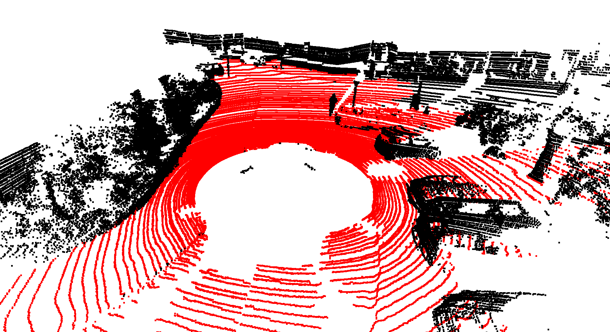

linefit
---

linefit is a ground segmentation algorithm for 3D point clouds. This repo we setup a python binding for the original C++ code and push to pypi for easy installation through `pip install linefit`.

Author: C++ code from [Lorenz Wellhausen](https://github.com/lorenwel), nanobind by [Qingwen Zhang](https://kin-zhang.github.io/).

Running on macOS, Windows and Linux, with Python Version >= 3.8.

## 0. Setup

Choose one of the following options to install the package (recommended to use Option A `pip install linefit`):

Option A: Install from pypi `pip install linefit`

Option B: Clone this repo and run following to build:
```bash
cmake -B build && cmake --build build
pip install .
python3 -c 'import linefit; print(linefit.__version__)'
```


## 1. Run the example

After installation, you can run the example by, it will directly show a default effect of demo data.

```bash
python example.py
```

A window will pop up and show the ground segmentation result.


## Parameter description

TL;DR: tune the `sensor_height` to offset the ground point z to `0`. Others are optional for better performance. If you are interested in the details, please read the following.

Parameters are set in `assets/config.toml`

This algorithm works on the assumption that you known the height of the sensor above ground. 
Therefore, **you have to adjust the `sensor_height`** to your robot specifications, otherwise, it will not work.

The default parameters should work on the KITTI dataset.

### Ground Condition
- **sensor_height**  Sensor height above ground.
- **max_dist_to_line**  maximum vertical distance of point to line to be considered ground.
- **max_slope**  Maximum slope of a line.
- **min_slope**  Minimum slope of a line.
- **max_fit_error**  Maximum error a point is allowed to have in a line fit.
- **max_start_height**  Maximum height difference between new point and estimated ground height to start a new line.
- **long_threshold**  Distance after which the max_height condition is applied.
- **max_height**  Maximum height difference between line points when they are farther apart than *long_threshold*.
- **line_search_angle**  How far to search in angular direction to find a line. A higher angle helps fill "holes" in the ground segmentation.

### Segmentation

- **r_min**  Distance at which segmentation starts.
- **r_max**  Distance at which segmentation ends.
- **n_bins**  Number of radial bins.
- **n_segments**  Number of angular segments.

### Other

- **n_threads**  Number of threads to use.

## Acknowledgement & Citation

The original C++ code is from [the repo we forked: lorenwel/linefit_ground_segmentation](https://github.com/lorenwel/linefit_ground_segmentation).

The original methods are described in the following paper:
```
@inproceedings{himmelsbach2010fast,
  title={Fast segmentation of 3d point clouds for ground vehicles},
  author={Himmelsbach, Michael and Hundelshausen, Felix V and Wuensche, H-J},
  booktitle={Intelligent Vehicles Symposium (IV), 2010 IEEE},
  pages={560--565},
  year={2010},
  organization={IEEE}
}
```

<!-- 
This function is a part of our new paper, which is under review. If you use this python function, please try to cite our paper to support us:
```
TODO
``` -->